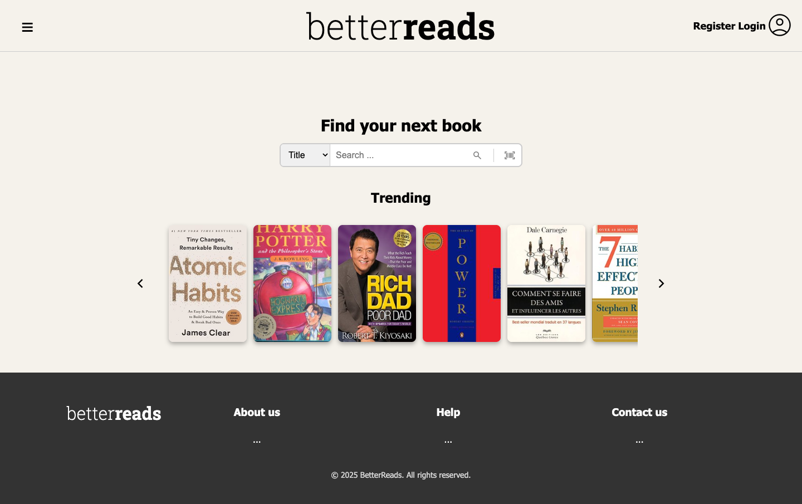

# BetterReads

> Archived. Rebuild at [dahl-jar/betterreads](https://github.com/dahl-jar/betterreads).

A Goodreads-style book tracking web app — search, review, and organize your reading. School project built with Spring Boot and the Open Library API.



## Features
- Trending books pulled live from the Open Library API
- User signup, login, and profile with bio
- Personal book collections (want to read / reading / read)
- Reviews and average ratings per book
- Search and browse by title, author, or ISBN

## Stack
- Java 21, Spring Boot 3.2 (Web, Data JPA, Security, Thymeleaf)
- PostgreSQL
- Open Library API
- Maven

## Run
Requires a running PostgreSQL and a `.env` with `DB_URL`, `DB_USERNAME`, `DB_PASSWORD`.

```bash
set -a && source .env && set +a
./mvnw spring-boot:run
```

App starts on http://localhost:8080.

Tests:
```bash
./mvnw test
```